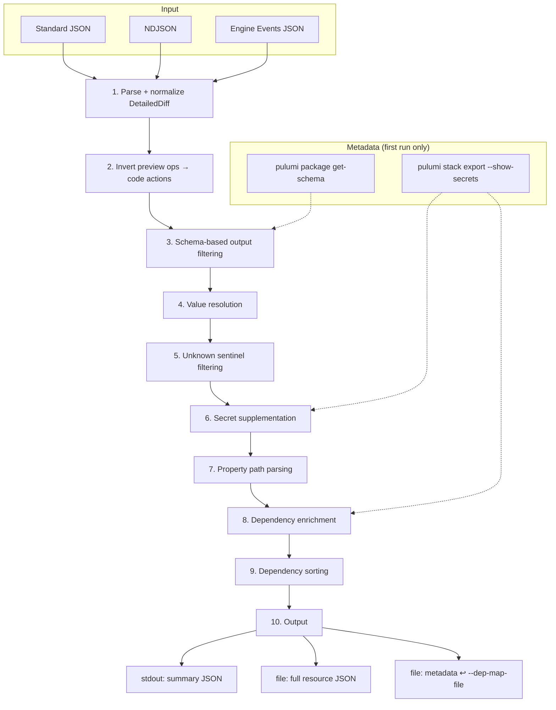

# pulumi-tool-drift-adopter

CLI tool for AI agents to adopt infrastructure drift back into Pulumi IaC.

[](https://github.com/pulumi-labs/pulumi-tool-drift-adopter/actions/workflows/test.yml)

## Overview

Drift occurs when infrastructure is modified outside of Pulumi. This tool detects drift and outputs JSON describing what code changes are needed to match the actual infrastructure state.

Designed for AI agents to call iteratively: run `next` → get changes → update code → repeat until clean.

## Installation

```bash
pulumi plugin install tool drift-adopter --server github://api.github.com/pulumi-labs
```

## Usage

### Mode 1: Standalone (runs preview internally)

```bash
cd your-pulumi-project
pulumi plugin run drift-adopter -- next [--stack <name>]
```

Runs `pulumi preview --json --refresh` internally and parses the output.

### Mode 2: With pre-generated events file

```bash
# First, run refresh and preview externally
pulumi refresh
pulumi preview --json > events.json

# Then pass the events file
pulumi plugin run drift-adopter -- next --events-file events.json
```

Use this mode when integrating with deployment systems that run preview separately.

### Flags

| Flag | Description |
|------|-------------|
| `--stack` | Pulumi stack name (default: current stack) |
| `--events-file` | Path to engine events file (skips running preview) |
| `--exclude-urns` | Resource URNs to exclude from results |
| `--dep-map-file` | Path to metadata file from a previous run (skips state export and schema fetch) |
| `--skip-refresh` | Omit `--refresh` from pulumi preview |
| `--output-file` | Path for full output file (default: auto-generated temp file) |
| `--project` | Project directory (default: ".") |

## Processing Pipeline

The `next` command accepts three input formats and normalizes all into a unified pipeline.

### Input Formats

| Format | Source | Wrapper |
|--------|--------|---------|
| **Standard JSON** | `pulumi preview --json` | `{"steps": [...]}` with `oldState`/`newState`, `kind`, `replaceReasons`/`diffReasons` |
| **NDJSON** | Pulumi service MCP tool | One JSON object per line, uses `old`/`new`, `diffKind`, `diffs` |
| **Engine Events JSON** | Pulumi Cloud API (`GET .../preview/{updateID}/events`) | `{"events": [...]}`, same field names as NDJSON |

Only `resourcePreEvent` entries are processed; `preludeEvent`, `summaryEvent`, `diagnosticEvent`, and `cancelEvent` are skipped.

### Field Mapping

| Concept | Standard JSON | NDJSON / Engine Events JSON |
|---------|--------------|--------|
| Wrapper | `{"steps": [...]}` | One JSON object per line / `{"events": [...]}` |
| Old state | `oldState` | `old` |
| New state | `newState` | `new` |
| Diff kind | `detailedDiff[key].kind` | `detailedDiff[key].diffKind` |
| Diff keys (fallback) | `replaceReasons`, `diffReasons` | `diffs` |

### Steps



Both formats are parsed into `auto.PreviewStep` structs, then processed through the following stages:

#### 1. Parse + normalize DetailedDiff

All three input formats are parsed into `auto.PreviewStep` structs. For update/replace steps where `DetailedDiff` is empty (common in standard JSON where `detailedDiff` is `null`), entries are synthesized from `ReplaceReasons` (preferred) or `DiffReasons` with `InputDiff: true`. Both the NDJSON and Engine Events JSON parsers perform equivalent normalization from their `diffs` field during format conversion.

#### 2. Invert preview ops → code actions

Preview output describes what Pulumi *would do* to infrastructure. The tool inverts this to describe what the *code* needs:

| Preview Op | Code Action |
|-----------|-------------|
| `create` | `delete_from_code` |
| `delete` | `add_to_code` |
| `update` | `update_code` |
| `replace` | `update_code` |

For `update_code`/`replace`, properties are extracted from `DetailedDiff`. For `add_to_code`, all input properties are extracted from `OldState`. For `delete_from_code`, no properties are needed.

#### 3. Schema-based output filtering

The tool fetches provider schemas via `pulumi package get-schema <provider>` and extracts the set of `inputProperties` for each resource type. DetailedDiff entries whose top-level property key is NOT in the schema's input properties are computed-only outputs (e.g., `tagsAll`, `arn`, `version`) and are automatically filtered out. This prevents the agent from trying to set properties that are managed by the provider.

Schema results are cached in the metadata file (`--dep-map-file`) to avoid re-fetching on subsequent calls.

#### 4. Value resolution

Property values are resolved with correct engine semantics:

- **`currentValue`** (what code says) — Always resolved from `NewState.Inputs`. During preview, `NewState.Outputs` may contain stale or placeholder data since the provider's `Update`/`Create` hasn't been called yet. Using Inputs only ensures the value reflects what the code actually declares.

- **`desiredValue`** (what infrastructure has) — Resolved from `OldState.Outputs` by default (the provider's last-known state), or from `OldState.Inputs` when `inputDiff=true` (comparing input-to-input).

This matches the Pulumi engine's own `TranslateDetailedDiff()` semantics documented in `pkg/engine/detailedDiff.go`.

#### 5. Unknown sentinel filtering

Preview data may contain Pulumi's unknown sentinel UUIDs as placeholder values (e.g., in cascading replace scenarios where a dependent resource's inputs aren't known yet). The tool recognizes all 7 sentinel types from the SDK (`plugin.UnknownStringValue`, etc.) and replaces them with nil. Properties where both current and desired values are nil after filtering are dropped.

#### 6. Secret value supplementation

When the tool detects `"[secret]"` as a property value, it supplements the real plaintext value from the state export (which is run with `--show-secrets`). The state export stores secrets in Pulumi's envelope format (`{sig.Key: sig.Secret, "plaintext": "..."}`) which the tool unwraps automatically. This ensures the agent receives actual values it can use to write working code, rather than opaque `[secret]` placeholders.

Secret supplementation only applies to `desiredValue` on `update_code` resources (from infrastructure state). `currentValue` retains `[secret]` since the agent can read the actual code value directly from the source file. For `add_to_code` resources, property values come directly from `OldState` and are not supplemented. When reusing `--dep-map-file` from a prior run, the state export is not fetched and `[secret]` values remain unsupplemented.

#### 7. Property path parsing

Property paths (e.g., `tags.Environment`, `ingress[0].fromPort`, `tags["kubernetes.io/name"]`) are parsed using the Pulumi SDK's `resource.PropertyPath` parser, which correctly handles bracket-quoted keys with dots, consecutive array indices, and mixed nested paths.

#### 8. Dependency enrichment

For map and array-valued properties (e.g., `subnetIds`, `tags`), individual elements are resolved against dependent resource outputs rather than collapsing the entire collection to a single dependency reference. Map entries preserve their keys; array entries use bracket-index paths (e.g., `subnetIds[0]`, `subnetIds[1]`). Properties that match a dependency get a `dependsOn` field with `resourceName`, `resourceType`, and optionally `outputProperty`.

#### 9. Dependency sorting

Resources are topologically sorted using Kahn's algorithm so that resources with no dependencies are emitted first (`dependencyLevel: 0`), followed by resources that depend on them (`dependencyLevel: 1`), and so on. This allows the agent to update code in dependency-level order, ensuring referenced resource variables are already declared before they are used.

```typescript
// dependencyLevel: 0 — no dependencies, update first
const vpc = new aws.ec2.Vpc("my-vpc", { cidrBlock: "10.0.0.0/16" });

// dependencyLevel: 1 — references vpc, update second
const subnet = new aws.ec2.Subnet("my-subnet", {
    vpcId: vpc.id,  // ← dependsOn: my-vpc
    cidrBlock: "10.0.1.0/24",
});
```

#### 10. Output

The tool produces three output files:

**Stdout — summary JSON:**

```json
{
  "status": "changes_needed",
  "summary": {
    "total": 3,
    "byAction": { "update_code": 2, "add_to_code": 1 },
    "byType": { "aws:s3/bucket:Bucket": 2, "aws:ec2/instance:Instance": 1 },
    "byTypeAction": { "aws:s3/bucket:Bucket": { "update_code": 2 } }
  },
  "outputFile": "/tmp/drift-adopter-output-123456.json",
  "depMapFile": "/tmp/drift-adopter-metadata-123456.json",
  "skippedCount": 0
}
```

The agent reads the full resource details from `outputFile`. On subsequent calls, pass `depMapFile` back via `--dep-map-file` to reuse cached metadata.

**Output file — full resource JSON:**

```json
{
  "status": "changes_needed",
  "summary": { "total": 2, "byAction": { "update_code": 1, "add_to_code": 1 }, "byType": {}, "byTypeAction": {} },
  "resources": [
    {
      "urn": "urn:pulumi:dev::app::aws:s3/bucket:Bucket::my-bucket",
      "name": "my-bucket",
      "type": "aws:s3/bucket:Bucket",
      "action": "update_code",
      "properties": [
        {
          "path": "tags.Environment",
          "currentValue": "dev",
          "desiredValue": "production"
        }
      ],
      "dependencyLevel": 0
    },
    {
      "urn": "urn:pulumi:dev::app::aws:ec2/instance:Instance::web-server",
      "name": "web-server",
      "type": "aws:ec2/instance:Instance",
      "action": "add_to_code",
      "inputProperties": {
        "ami": "ami-0abcdef1234567890",
        "instanceType": "t3.micro",
        "subnetId": {
          "dependsOn": {
            "resourceName": "my-subnet",
            "resourceType": "aws:ec2/subnet:Subnet"
          }
        },
        "tags": {
          "Name": "web-server",
          "Environment": "production"
        }
      },
      "dependencyLevel": 1
    }
  ],
  "skipped": [],
  "depMapFile": "/tmp/drift-adopter-metadata-123456.json"
}
```

**Metadata file — cached for reuse via `--dep-map-file`:**

```json
{
  "dependencies": {
    "urn:pulumi:dev::app::aws:ec2/instance:Instance::web-server": {
      "subnetId": {
        "resourceName": "my-subnet",
        "resourceType": "aws:ec2/subnet:Subnet",
        "outputProperty": "id"
      }
    }
  },
  "inputProperties": {
    "aws:ec2/instance:Instance": ["ami", "instanceType", "subnetId", "tags"],
    "aws:s3/bucket:Bucket": ["bucket", "tags", "acl"]
  }
}
```

The state export used for secret resolution (`StateLookup`) is not serialized — it is only available during the initial run.

**Status values:** `changes_needed` (code changes required), `clean` (no drift), `stop_with_skipped` (all remaining resources were skipped), `error` (preview failed).

**Actions:** `update_code` (update properties to match `desiredValue`), `delete_from_code` (remove resource from code), `add_to_code` (add resource to code using `inputProperties`). Values that reference other resources are wrapped in `{"dependsOn": {"resourceName": "...", "resourceType": "..."}}`.

**Property-level intent** is conveyed by presence/absence of `currentValue` and `desiredValue`: both present → update; only `desiredValue` → add to code; only `currentValue` → remove from code.

**Skipped resources** in the `skipped` array include a `reason` field: `"excluded"` (matched `--exclude-urns`) or `"missing_properties"` (no actionable property changes after filtering).

**Value truncation:** String values longer than 200 characters are replaced with `<string: N chars>`.

## Limitations

This tool relies on `pulumi refresh` which only tracks resources already in state. Resources created outside Pulumi must first be imported with [`pulumi import`](https://www.pulumi.com/docs/cli/commands/pulumi_import/).

## Development

```bash
git clone https://github.com/pulumi-labs/pulumi-tool-drift-adopter.git
cd pulumi-tool-drift-adopter
just install-tools
just install-hooks
just build
just test-unit
```

See [CONTRIBUTING.md](CONTRIBUTING.md) for guidelines.

## License

Apache 2.0 - See [LICENSE](LICENSE)
